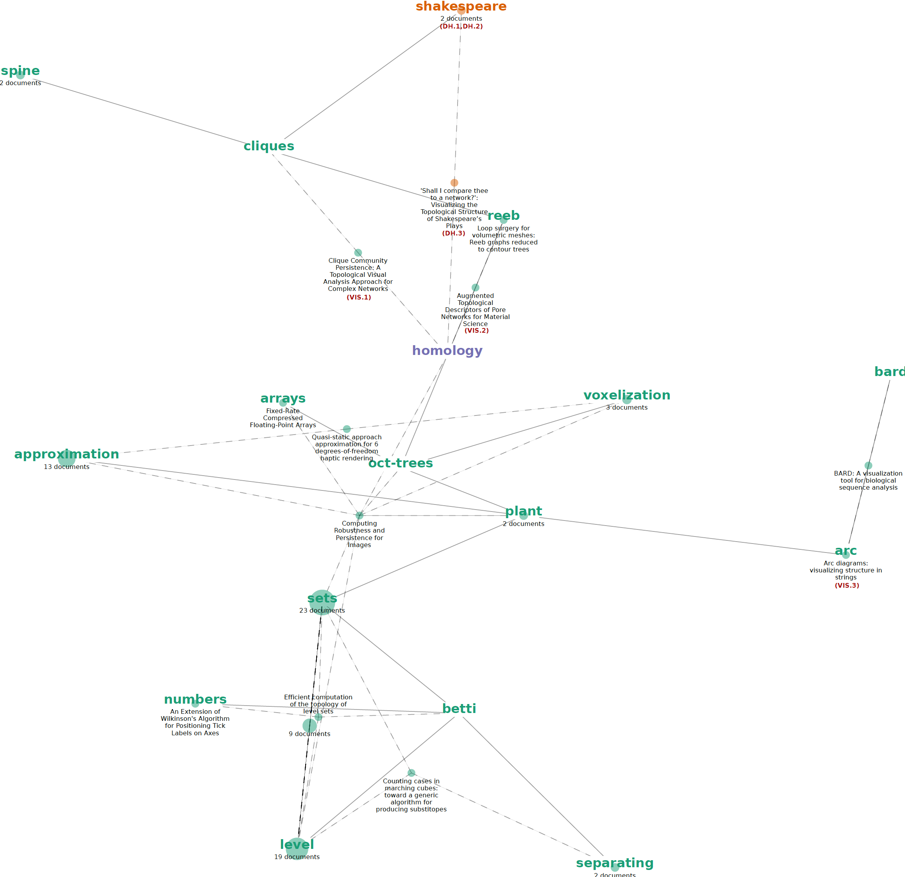

# Cross-domain joint visualization of documents and keywords

A [Jupyter](https://jupyter.org/) notebook to visualize learning paths on research papers collections using [Latent Semantic Analysis](http://www.scholarpedia.org/article/Latent_semantic_analysis) performed on user-authored keywords.

These are the materials for the paper:

*A. Benito and R. Theron, “Cross-domain Visual Exploration of Academic Corpora via the Latent Meaning of User-authored Keywords”, 06-May-2019. [Online]. Available: https://osf.io/h29qv.*

This code implements a visualization scheme to explore a collection of research papers with a pre-defined aim. It offers a perspective of the target dataset that reveals the kind of knowledge you are interested in extracting. 

The method employs keyword associations obtained from an auxiliary bag-of-words that represents the *aim* of your research. 
These associations can be freely composed from your personal collection or from any other collection of your liking that is linked to the theme you want to explore. 

In the paper we showcase how a large collection of [visualization research papers](https://vispubdata.org) can be explored using a Digital Humanities [query corpus](datasets/dh_papers-complete.json).

## Reproducibility 

You have three options to run the code: Google's [Colaboratory](https://research.google.com/colaboratory/), [CodeOcean](https://codeocean.com) and locally on your own machine. 
Instructions adapted from Jeffrey Perkel's [example notebook](https://github.com/jperkel/example_notebook) made for *Perkel, J. M. (2018). Why Jupyter is data scientists' computational notebook of choice. Nature, 563(7729), 145.*

**To use Colab:**
1. Click the `Open in Colab` button above. It will launch the notebook directly.
2. Make the notebook live by clicking 'Connect' in the Colab toolbar. 
3. Uncomment the two cells under 'Google Colab only' by removing the leading `#` on each line.
4. Select `Runtime > Run All` in the menu to execute the notebook. (You may get a warning that the page was not authored by Google.) 
5. Go the bottom and check the visualization that was just created.

**To use CodeOcean:**
1. Click the `Open in CodeOcean` button above. It will launch the notebook directly. Then either:
2. Click the 'Run' button at the top right (click the `keywords_vis.html` file in the Results pane at right to see the output); or 
3. Launch an [interactive Jupyter session within Code Ocean](https://help.codeocean.com/interactive-sessions/interactive-jupyter-sessions).

**To run the notebook locally (python 3.6 and pip required)**
1. `git clone https://github.com/ale0xb/keywords-vis`
2. `cd keywords-vis`
3. `mkvirtualenv keywords-vis` (if you have [virtualenvwrapper](https://pypi.org/project/virtualenvwrapper/) installed). Otherwise create a virtual environment as usual.
4. When the virtual environment has been activated, use `pip install -r requirements.txt`.
5. `python -m ipykernel install --user --name=keywords-vis`.
6. Launch jupyter with `jupyter notebook` and [keywords_vis.ipynb](keywords_vis.ipynb)
7. Select the kernel that was created in step 5: Kernel > Change Kernel > keywords-vis
8. Run all cells: Kernel > Restart & Run All 

## Visualizing other queries
You can try other queries by modifying the variable `path_keys`, which is set to show the first use-case of the paper: `path_keys = ['shakespear']`
Any other combination of query keywords is accepted. You can find all available query keywords in `merged_paths_dict`. 

## Regenerating the model / Using your own data
If you want to use a different set of keywords (or use two completely new collections) you must regenerate the model that is created below the notebook section ***Generating the model***. In order to do so, remove [./model/all-paths.pkl](model/all-paths.pkl) from the environment and run the code again. (It may take several hours depending on the size of your data and processing power).

